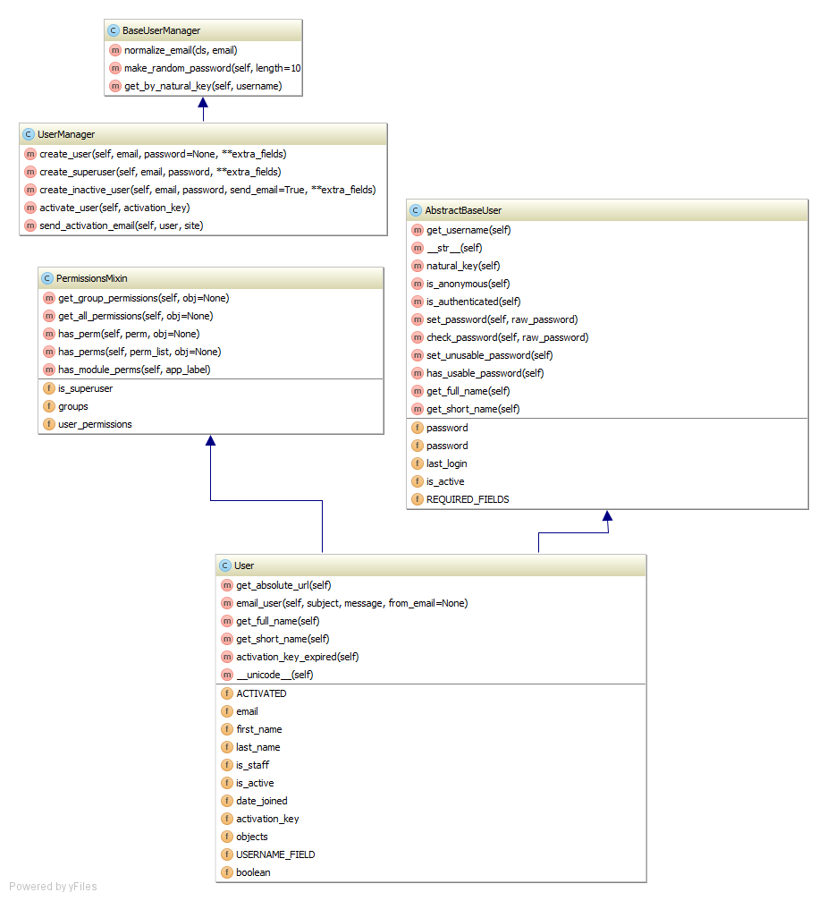

Django registration para a versão 1.5 do framework
==================================================

Features
--------

* App accounts com as funcionalidades do django-registration
* Registro e autenticação de usuários com o email
* Campo ReCaptcha e campo de confirmação de regras do serviço opcionais

Diagrama ilustrando melhor os campos de métodos das classes envolvidas
----------------------------------------------------------------------

Settings
--------

.. code-block:: python

    #AUTH_USER_MODEL = 'registration.EldonUser'
    AUTH_USER_MODEL = 'accounts.User'
    LOGIN_REDIRECT_URL = '/accounts/profile/'
    LOGIN_URL = '/accounts/login/'
    LOGOUT_URL = '/accounts/logout/'

    # This is the number of days users will have to activate their accounts after registering. If a user does not activate
    # within that period, the account will remain permanently inactive
    ACCOUNT_ACTIVATION_DAYS = 3

    # Adds a term of service checkbox to the registration form
    ADD_TOS = True

    # if True, the user will be immediately logged in after his account activation.
    AUTHENTICATE_WHEN_ACTIVATE = True

    # Adds recaptcha to the registration form
    ADD_RECAPTCHA = True

    # ReCaptcha (localhost)
    RECAPTCHA_PUBLIC_KEY = os.environ['RECAPTCHA_PUBLIC_KEY']
    RECAPTCHA_PRIVATE_KEY = os.environ['RECAPTCHA_PRIVATE_KEY']
    RECAPTCHA_USE_SSL = False

    # Email
    EMAIL_BACKEND = 'django.core.mail.backends.console.EmailBackend'
    EMAIL_HOST = 'localhost'
    EMAIL_HOST_USER = 'email@localhost'
    EMAIL_HOST_PASSWORD = 'S3cr3t3'
    EMAIL_SUBJECT_PREFIX = '[EMAIL]'
    EMAIL_PORT = 587
    EMAIL_USE_TLS = False

requirements.txt
----------------

    Django==1.5
    Unipath==0.2.1
    distribute==0.6.35
    wsgiref==0.1.2
